<div align="center">

# 👋 Hi, I'm Imasha Fernando

### 💻 Full-Stack Developer | 🎓 BIT Undergraduate | 🚀 Tech Enthusiast

[](https://git.io/typing-svg)

<p align="center">
  <a href="https://linkedin.com/in/imashafernando"></a>
  <a href="mailto:fernandoimasha2003@gmail.com"></a>
  <a href="https://discord.gg/immiiifdo03"></a>
  <a href="https://fb.com/imasha fernando"></a>
  <a href="https://instagram.com/imasha fernando"></a>
</p>


</div>

---

## 🚀 About Me


```yaml
name: Imasha Fernando
located_in: Colombo, Sri Lanka
education: BIT Undergraduate
university: University of Colombo School of Computing
current_focus: Full-Stack Web Development
learning: Spring Boot, Angular, React, Cloud Technologies

fields_of_interest:
  - Web Development
  - Software Engineering
  - UI/UX Design
  - Database Architecture
  - API Development
```

<br>

🎯 **Current Focus:**
- 🌱 Mastering **Spring Boot**, **Angular**, and **React**
- 🔭 Building scalable web applications
- 💡 Contributing to open-source projects
- 📚 Exploring cloud technologies and microservices

💬 **Ask me about:** Java, JavaScript, TypeScript, Node.js, Web Development, and anything tech!

⚡ **Fun Fact:** I believe semicolons are optional, but a good night's sleep for developers is absolutely not! 😴

---

## 🛠️ Tech Stack

<details open>
<summary><b>🔥 Core Languages</b></summary>
<br>


</details>

<details open>
<summary><b>⚡ Frameworks & Libraries</b></summary>
<br>


</details>

<details open>
<summary><b>🗄️ Database Technologies</b></summary>
<br>


</details>

<details open>
<summary><b>🔧 Tools & Technologies</b></summary>
<br>


</details>

---

## 📊 GitHub Analytics

<div align="center">
  
  
</div>

<div align="center">
  
  
</div>

---

## 🏆 GitHub Trophies

<div align="center">
  
</div>

---

## 📈 Contribution Graph

<div align="center">
  
</div>

---

## 🎯 Weekly Development Breakdown

<!--START_SECTION:waka-->
<!--END_SECTION:waka-->

---

## 🌟 Featured Projects

<div align="center">

[](https://github.com/ImaFdo/ImaFdo)

</div>

> 💡 **Explore more projects** on my [GitHub repositories](https://github.com/ImaFdo?tab=repositories)

---

## 💼 Professional Journey

```mermaid
graph LR
A[🎓 Started BIT] --> B[💻 Learning Web Dev]
B --> C[🚀 Mastering Frameworks]
C --> D[🌟 Building Projects]
D --> E[🎯 Future Tech Leader]
```



---

## 🎓 Certifications & Achievements

- 🎓 BIT Undergraduate at University of Colombo School of Computing
- 💻 Full-Stack Web Development Journey
- 🌟 Continuous Learner in Modern Technologies

---

## 📫 Let's Connect

<div align="center">

**I'm always open to interesting conversations and collaboration opportunities!**

[](https://linkedin.com/in/imashafernando)
[](mailto:fernandoimasha2003@gmail.com)
[](https://github.com/ImaFdo)

</div>

---

## 💖 Support My Work

<div align="center">

If you like my work and want to support me, consider buying me a coffee! ☕

[](https://ko-fi.com/IMA...)

</div>

---

<div align="center">

### 💭 Random Dev Quote


### 🐍 Contribution Snake


---

<p align="center">
  
</p>

**✨ Thank you for visiting my profile! Let's build something amazing together! ✨**

<p align="center">Made with ❤️ by Imasha Fernando</p>

</div>
